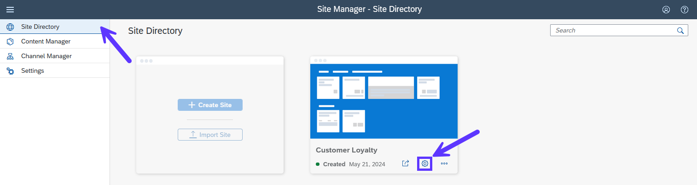
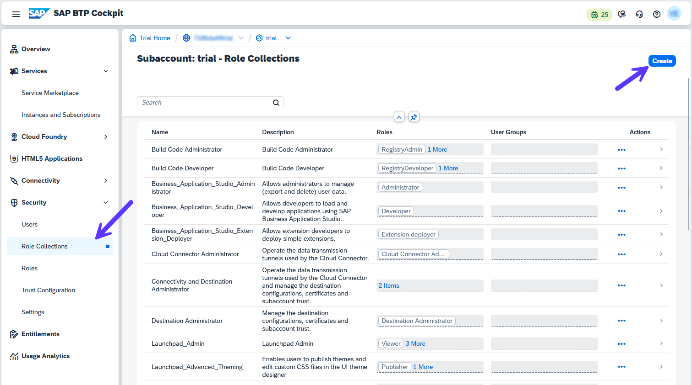
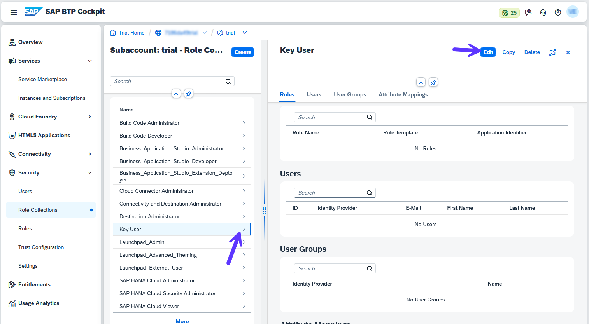
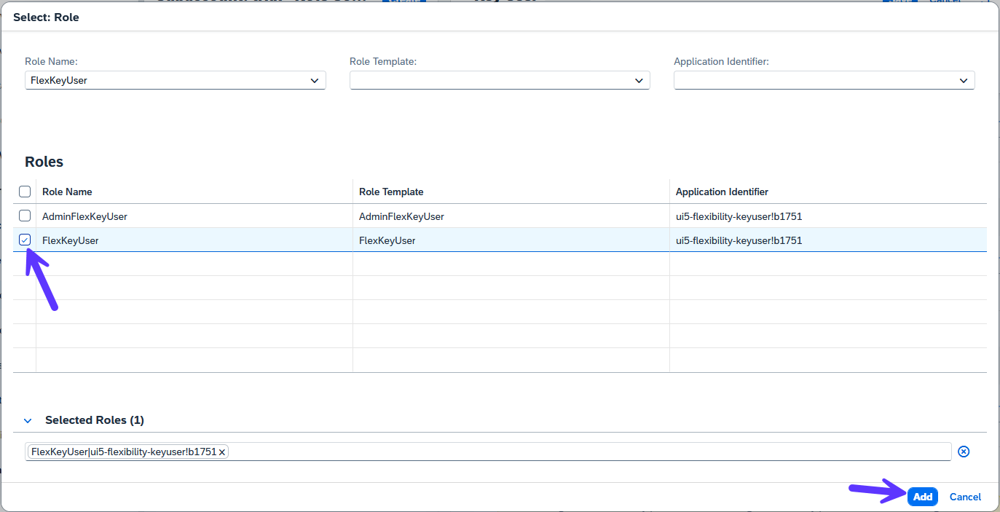
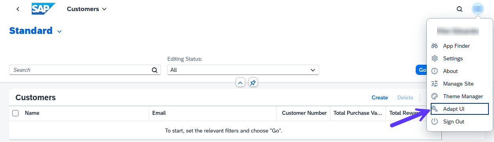
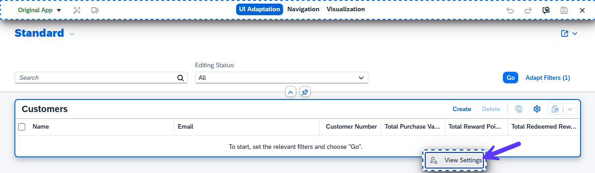
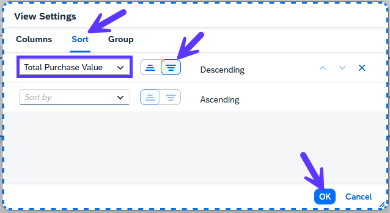
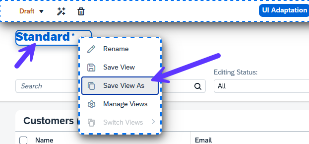
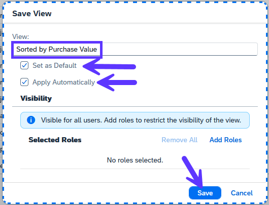
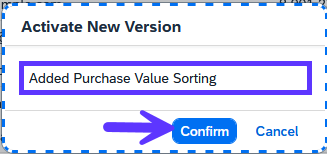

# 10 - Adapt UI as Key User

1. Now that the site is deployed and integrated in SAP Build Work Zone, we want to enable it for Key User adaptation. Go to **Site Directory** and press on the **Site Settings** icon for your site.

2. Press **Edit** and activate *Key User Adaptation*. Then press **Save**.

3. You need a dedicated key user role to be able to adapt UIs. Go back to your Subaccount, then navigate to **Security** -> **Role Collections** and press on **Create**.

4. Enter *Key User* as the name and press **Create**. Then find it in the list and click on the arrow to open the details. Press on **Edit**.

5. In the *Roles* section, use the value help to find the role *FlexKeyUser* and select it. Then press **Add** and press **Save**.

6. Now assign this role collection to your user. Go to **Security**->**Users**, select your user, press **Assign Role Collection** and select the role you just created from the list.

7. Go back to the **Site Directory** in SAP Build Work Zone and go to the site. Open the **Customers** application and press **Adapt UI** on the user actions menu to start adaptation mode. If you don't see **Adapt UI**, try opening the application link in an incognito window - it could be missing due to a caching issue.

8. You are now adapting the application as a key user. In contrast to personalization, this adaptation will be visible for all the end users of the application. Right-click on the table and press **View Settings**.

9. In the dialog, define that the data should be sorted by *Total Purchase Value* descending and press **OK**.

10. Notice that the *Variant Management* control now shows a dirty state (*). Right click on it and press **Save View As**.

11. Choose any name (e.g. *Sorted by Purchase Value*), make it the default view and set it to apply automatically. Then press **Save**.

12. You now have a *Draft Adaptation*. To make it active for all users, press on **Activate** (the magic wand icon). Enter any name and press **Confirm**.

13. Now leave UI adaptation by pressing on **Exit** (the button with the "X" on the top toolbar). If you refresh the browser tab, you will notice that the application now loads directly on the view you created, already displaying the sorted data.

Congratulations! You have successfully adapted your application.