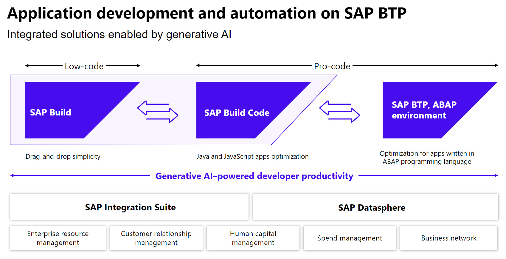
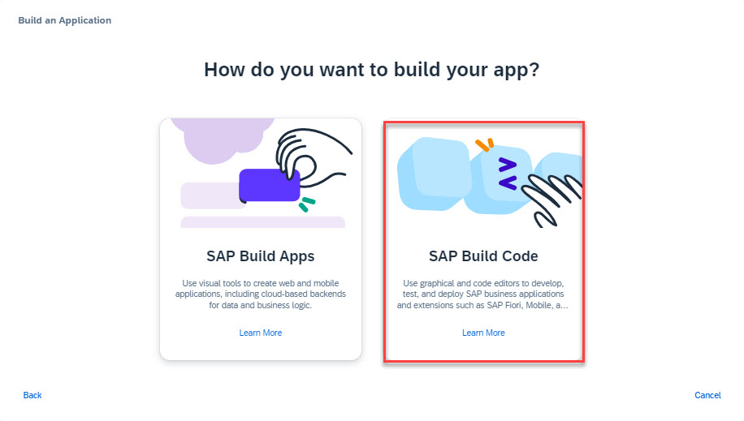
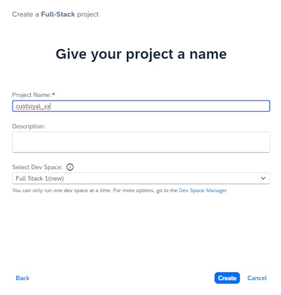

# 2 - Create New Project in SAP Build Code

## Introduction into SAP Build Code

SAP Build Code is a turnkey development environment that combines runtime and design-time capabilities with built-in solutions for DevOps and Application Lifecycle Management.

**Benefits of SAP Build Code**

- Achieve a clean core by developing side-by-side extensions with SAP Build Code
- Optimize developer efficiency with generative AI, productivity tools, and application lifecycle management
- Enables developers to build and extend powerful end-to-end business applications with programming language of choice 
- Leverage interoperability between classic development and low-code development tools 

**Key capabilities of SAP Build Code**

- Differentiate cloud solution with stable and future-proof foundation, solution becomes future proof and works with different editions of S/4HANA, and quality assurance options included
- Enable developers to code faster and smarter, code generation based on generative AI, Ease of Application Lifecycle Management 
- Application and extension development, Integrate with SAP and non-SAP systems
- Easy access for all types of developers with centralized Lobby, for Fusion Development

## Creation of a new project

## Access Lobby

The starting point for this tutorial is the Lobby of SAP Build, the central entry point for all SAP Build products.

Open the lobby from your SAP Build Code landing page.

## Create a new project

1. Click on **Create** button

2. Select **Build an Application**

3. Select **SAP Build Code**

4. Select **Full-Stack Application**

5. Type in your Project Name in the following format: `custloyal_xx` xx = your initials

6. Click the **Create** button.

> The creation of the project can take up to 1 minute.
**[Next Step: Create Data Entities with Joule](./3_Create_Data_Entities_with_Joule.md) >**