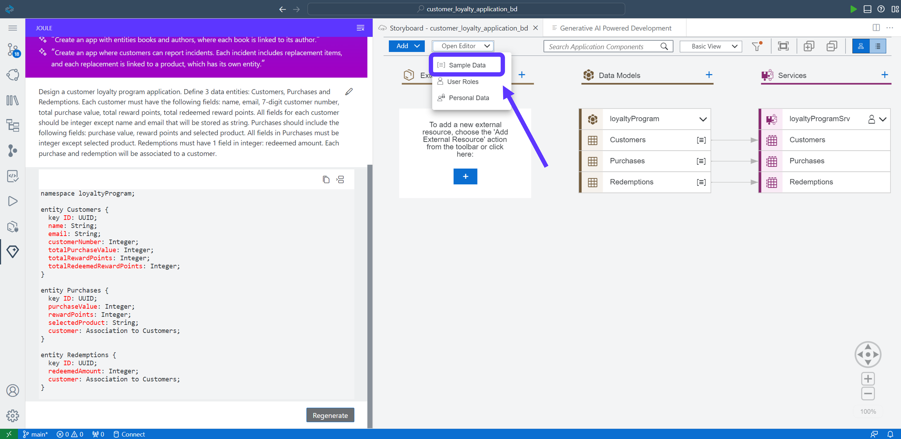
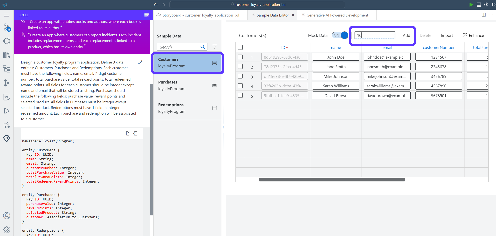
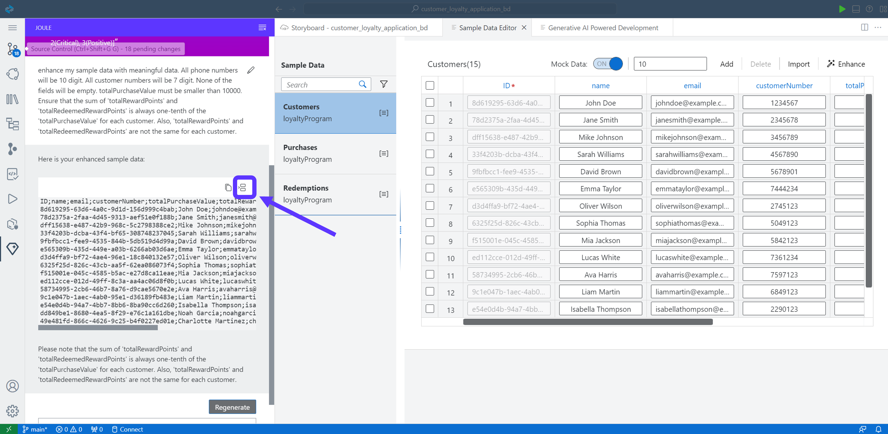

# 4 - Enhance Sample Data with Joule  

Joule created the Data Model and Services and additionally some sample data.
We will now use Joule to enhance the sample data.

## Enhance Sample Data

1. Open the the Sample Data editor in the Storyboard by selecting **Open Editor** -> **Sample Data**




2. Select **Customers** data entity. Add 5 more rows to the entity and push **Add** button




3. Click **Enhance**. This will reopen Joule to modify the sample data. Then, use the following prompt in Joule:

```code
Enhance my sample data with meaningful data. Any phone numbers must be 10 digits. All customer numbers must be 7 digits. No fields may be empty. Total purchase value must be smaller than 10000 und unround. Total reward points and total redeemed reward points both must be unround and different and always sum to one-tenth of the total purchase value for each customer.
```


 
4. You can see the customer names, email adresses and purchases are created. Accept the new sample data created by Joule. 




**[Next Step: Create Application Logic with Joule](./5_Create_Application_Logic_with_Joule.md) >**
