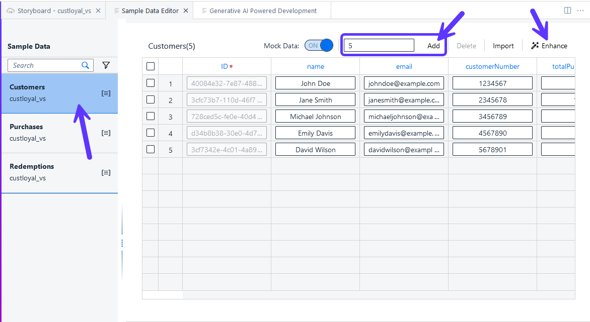
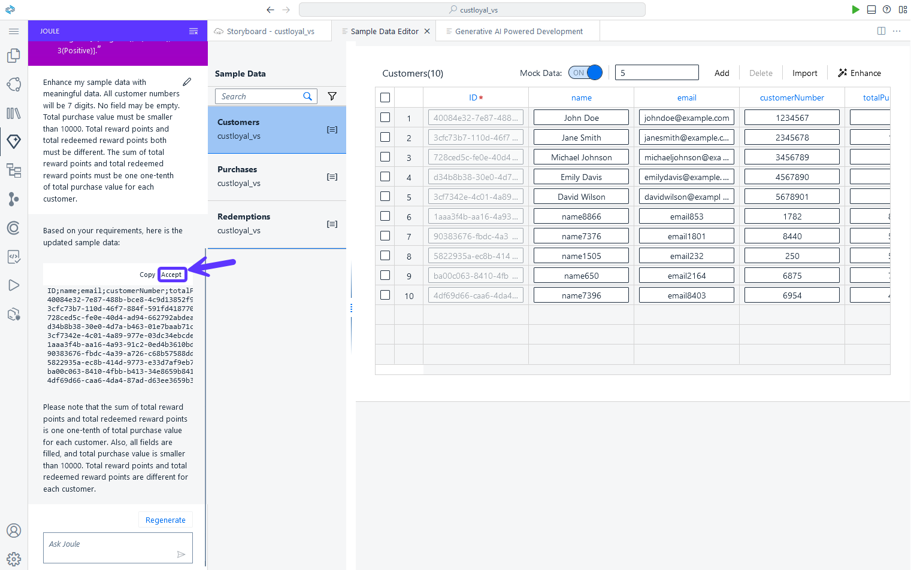

# 4 - Enhance Sample Data with Joule  

Joule created the Data Model and Services and additionally some sample data.
We will now use Joule to enhance the sample data.

## Enhance Sample Data

1. Open the the Sample Data editor in the Storyboard by selecting **Open Editor** -> **Sample Data**


2. Select **Customers** data entity. Add 5 more rows to the entity and push **Add** button. Then press **Enhance** to reopen Joule to modify the sample data.




3. Use the following prompt in Joule:

```code
Enhance my sample data with meaningful data. All customer numbers will be 7 digits. No field may be empty. Total purchase value must be smaller than 10000. Total reward points and total redeemed reward points both must be different. The sum of total reward points and total redeemed reward points must be one one-tenth of total purchase value for each customer.
```
 
4. You can see that the customer names, email adresses and purchases are created. Accept the new sample data created by Joule.



> Note: Before proceeding, make sure that all entities have valid data entries. Otherwise you might get errors later during deployment.

## [Next Step: Create Application Logic with Joule](./5_Create_Application_Logic_with_Joule.md) >
