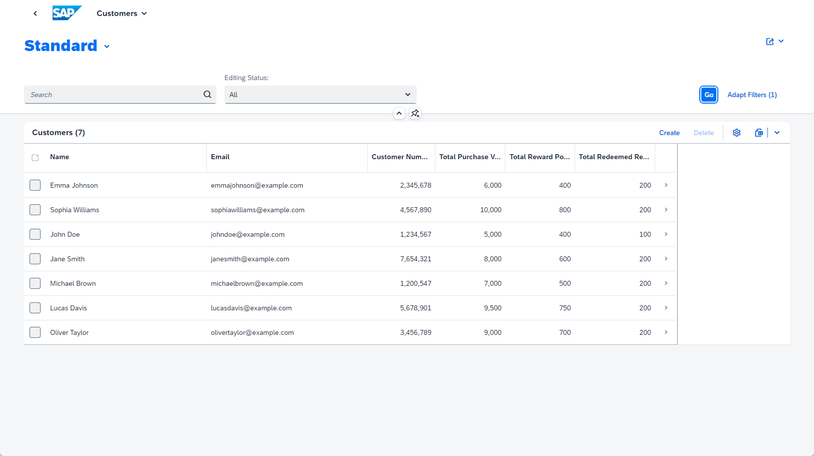

# 6 - Add UI to the Application

To display and test the content we created for the customer loyalty program, we need to create an SAP Fiori elements UI.

## Add UI 

1. Go to back to the Storyboard and add a UI application. **TODO: FIX SCREENSHOT - PROJECT NAME**

2. We will start with the user interface for the **Purchases** data entity. 
Set the **Display name** to **Purchases** and the **Description** to **Manage Purchases**, and then click **Next**.

3. We are using the browser, so we will select **Template-Based Responsive Application** as the UI Application type, and click **Next**.

4. Select **List Report Page** as the UI application template, and click **Next**. 

5. Select **Purchases** as the **Main entity**, and click **Finish**. The page will be created now.

It might take a few moments for the UI to be created because the dependencies need to be installed. 

6. Repeat steps 2 through 5 to create additional UI apps for the **Customers** and the **Redemptions** entities.
**Customer**:
* Display name: **Customers**  
* Description: **Manage Customers**
* UI Application type: **Template-Based Responsive Application**  
* UI Application Template: **List Report Page**  
* Main Entity: **Customers**  
**Redemptions**:
* Display name: **Redemptions**  
* Description: **Manage Redemptions**  
* UI Application type: **Template-Based Responsive Application**  
* UI Application Template: **List Report Page**  
* Main Entity: **Redemptions**  

And that's it! You've created an application.

7. To preview your application, once the files have been generated, go to the upper-right corner, and click  (Run and Debug).

The application's preview is displayed.

8. Click **Go**.

The customer information is displayed.

9. From the dropdown list at the top of the page, select **Home** to go back and preview the other applications.

