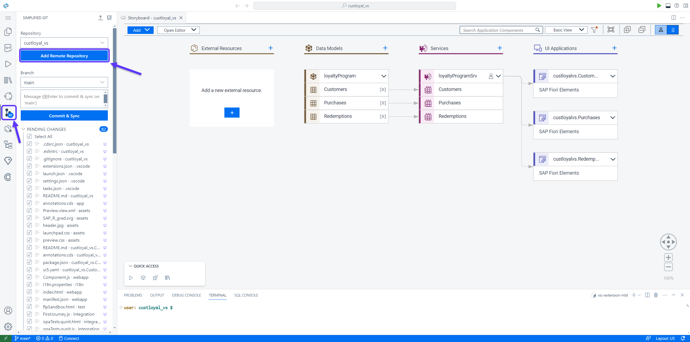
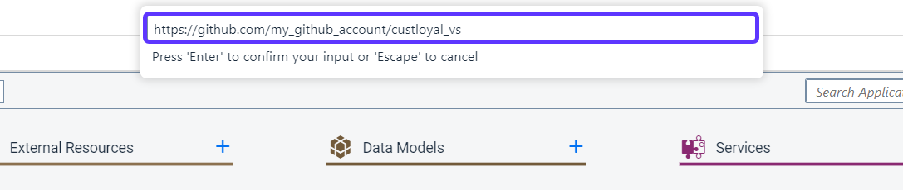
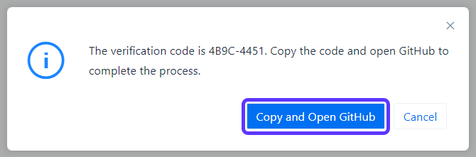
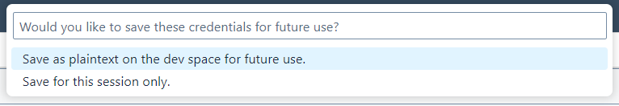

# 7 - Connect to Git (Optional)

## Prerequisite
To perform this step you need a remote GitHub repository, for example on your private GitHub account.

## Connect to Git
1. On the side toolbar, press **Simplified Git** and then **Add Remote Repository** (it might take a while for the pending changes to load).

2. Enter the URL to your remote repository and press *Enter*.

3. A dialog for verification will come up. Press **Copy and Open GitHub** and paste the code. Then follow the instructions on the GitHub page to complete the authorization.

4. Go back to the Business Application Studio tab. You can then choose whether to save the credentials for future use.

5. All done! Your project is now connected to the remote repository.

## [Next Step: Deploy and Configure CI/CD](./8_Deploy.md) >