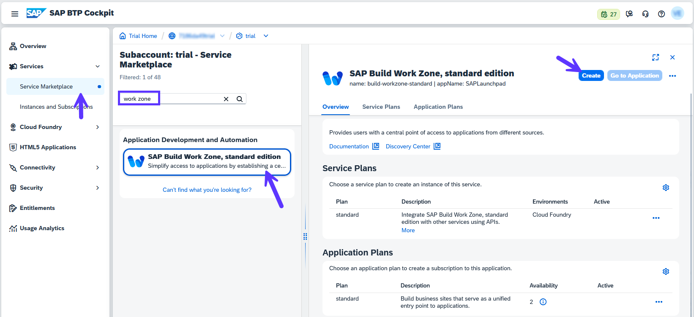
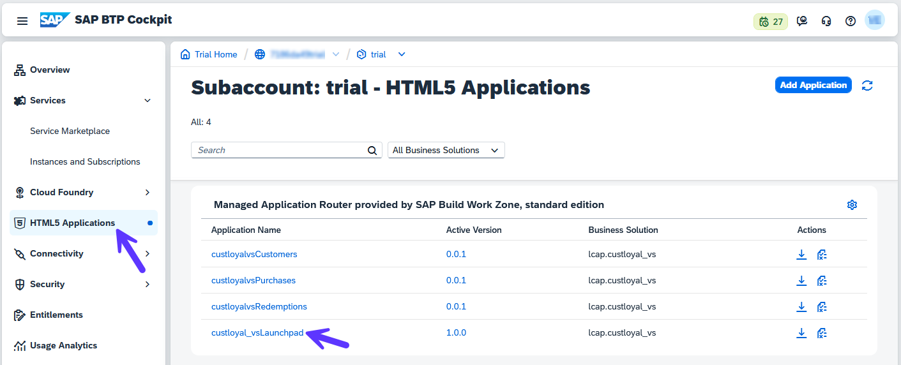
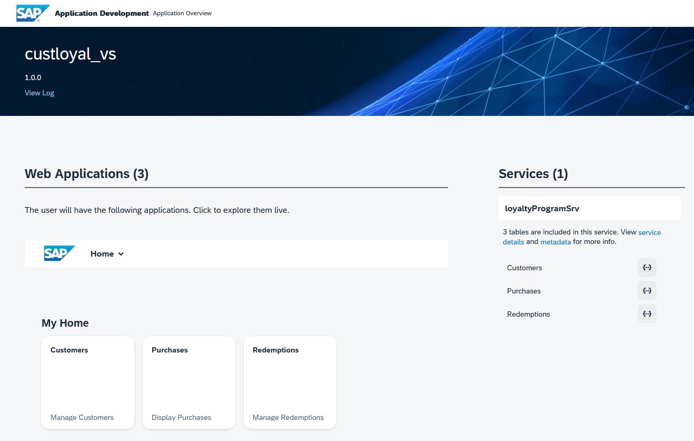

# 8 - Deploy

## Preparation

1. Go to your trial account in SAP BTP Cockpit and navigate to your subaccount. Then go to **Cloud Foundry** -> **Spaces**, open your space and keep this tab open since you will need this URL to retrieve parameters for a future step.

2. Open your trial subaccount in another browser tab and navigate to **Services** -> **Service Marketplace**. Look for *SAP HANA Cloud* and press **Create**.

3. Under *Plan*, select **Subscriptions/tools** and press **Create**.

4. Now go back to the Service Marketplace and look for *SAP Build Work Zone*. Then click on **Create** and in as *Plan* choose **subscriptions** -> **standard**. Then press **Create**.

5. Go to **Security**->**Users** and assign Role Collection *SAP HANA Cloud Administrator* to your user.

6. Go to **Instances and Subscriptions** and wait for the *SAP HANA Cloud* subscription to be in the list. Then click on the navigation icon.

7. SAP HANA Cloud Central will load. If you see an error message asking you to sign out for new authorizations to take effect, simply use the link in the error message and sign in again.

8. Click on **Create Instance**:

9. Follow the steps below to configure the instance:

* Choose **type** *SAP HANA Cloud, SAP HANA Database* then press **Next Step**.
* Enter any **Name** you like, e.g. *TutorialAppInstance* and a password you will remember. Then press **Next Step**
* SAP HANA Database - leave the default values and press **Next Step**
* SAP HANA Database Availability Zone and Replicas - no action required, simply press **Next Step**
* SAP HANA Database Advanced Settings - Here some configuration is required:
  * Select **Allow all IP addresses**
  * Instance Mapping - press **Add Mapping**. For the Organization ID and Space ID we will need the URL from the tab that we left open in step 1 of the Preparation.
  * The URL has the following format: https://canary.cockpit.btp.int.sap/cockpit#/globalaccount/<global account ID\>/subaccount/\<subaccount ID\>/org/\<org ID\>/space/\<space ID\>/applications
  * Copy the \<org ID\> for **Organization ID** and \<space ID\> for **Space ID**
  * Press **Create Now**

10. Press **Create Instance**. This process might take some minutes. Wait until the instance is created before proceeding to Deployment - it will change from status *Creating* to *Running*

## Deployment

1. Now go back to your app in SAP Build Code and open the **Task Explorer**. Then press on **Run** icon for the *Deploy* task.

2. First the app will be built. You will see the progress on the console. Wait for it to be finished and then you will be presented with the *Cloud Foundry Sign In and Targets* page.

3. Use the link to open a new browser page to generate an SSO passcode. If you are asked to enter your password, be sure to use the sap.com password (not necessarily the same as the one used in the SAP Universal ID login). You may also reset the password if needed.

4. Copy the *Temporary Authentication Code* into the field and press **Sign In**.

5. Now select the previously created *Organization* and *Space* and press **Apply**. Wait for the deployment to be successul (this might take a couple of minutes).

6. After the deployment is ready, go back to your subaccount and navigate to **HTML5 Applications**. Click on the *Launchpad* link. From this launchpad you can navigate to the Web Applications.

Congratulations! Your app is now deployed to Cloud Foundry.

## [Next Step: Integrate with SAP Build Work Zone](./9_Integrate_with_Work_Zone.md) >