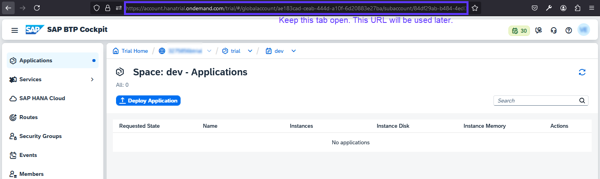
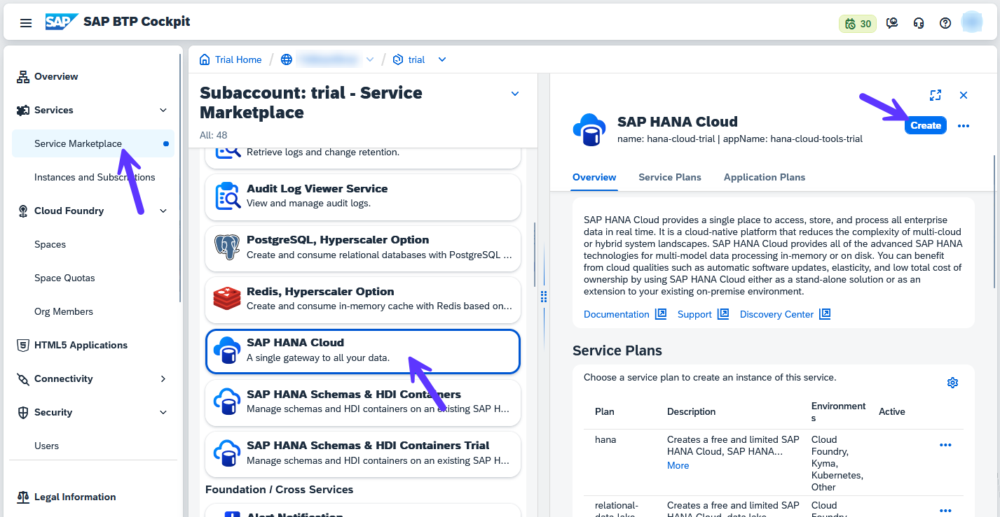

# 7 - Deploy

## Preparation

1. Go to your trial account in SAP BTP Cockpit and navigate to your subaccount. Then go to **Cloud Foundry** -> **Spaces**, open your space and keep this tab open since you will need this URL to retrieve parameters for a future step.

2. Open your trial subaccount in another browser tab and navigate to **Services** -> **Service Marketplace**. Look for *SAP HANA Cloud* and press **Create**.

3. Under *Plan*, select **Subscriptions/tools** and press **Create**.

4. Go to **Security**->**Users** and assign Role Collection *SAP HANA Cloud Administrator* to your user.

5. Go to **Instances and Subscriptions** and wait for the *SAP HANA Cloud* subscription to be in the list. Then click on the navigation icon.

6. TBD 

## Deployment
TBD

## [Next Step: Integration with WorkZone](./9_Integrate_to_WZ.md) >