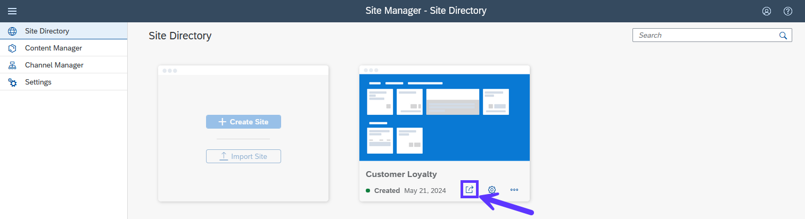

# 9 - Integrate with SAP Build Work Zone

1. On your subaccount, navigate to **Security** -> **Users**. Then assign the *Launchpad_Admin* role to your user.

2. Navigate to **Services** -> **Services and Subscriptions** and click on the *Launch Application* icon for *SAP Build Work Zone, standard edition*. It might take a while for the cache invalidation related to the role assignment to take place. If that is the case for you, simply launch the application in an incognito window.

3. On the *Site Directory*, press on **Create Site**. Choose any name you like and proceed. Nothing needs to be changed on the site overview - navigate back to the Site Editor.

4. Go to **Channel Manager** and press on **Update Content** for the *HTML5 Apps*. Wait for the update to be completed.

5. Navigate to **Content Manager** and press on **Content Explorer**. Then click on the **HTML5 Apps** tile and select the *Purchases*, *Customers* and *Redemptions* apps. **Don't select the Launchpad since SAP Build Work Zone will be our productive launchpad!**. Press *Add*.

6. Go back to **Content Manager** and click on **Everyone**. Then click on **Edit**, assign all the apps and press **Save**.

7. Navigate again to **Content Manager**, press on **Create** and select **Group**. Type in any *Title*, assign all apps and press **Save**.

8. Finally, navigate to **Site Directory** and click on the **Go to site** icon. All the apps should be there.

Well done! Your app is now integrated with SAP Build Work Zone.

## [Next Step: Adapt the UI as Key User](./10_Adapt_UI_as_Key_User.md) >